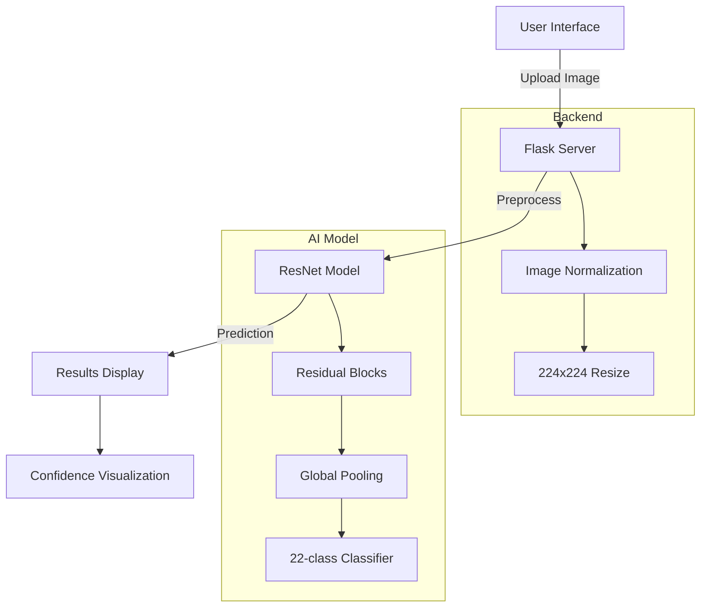

# 🩺 Skin Disease Classification Web App

[](https://www.python.org/)
[](https://pytorch.org/)
[](https://flask.palletsprojects.com/)
[](LICENSE) <br>
A deep learning web application that classifies **22 skin conditions** with **85% accuracy** using a custom ResNet model.
 *(Add your demo.gif to /static/images/)*

## 📌 Table of Contents
- [System Architecture](#-SystemArchitecture)
- [Features](#-Features)
- [Tech Stack](#-Tech-Stack)
- [How to Run](#-Quick-Start)
- [Performance](#-Performance)
- [Demo](#-demo)
- [Contributing](#-contributing)
## 🏗️ SystemArchitecture


## 🌟 Features
- 🖼️ Upload skin images via drag-and-drop
- 🔍 AI-powered analysis with confidence scores
- 📱 Mobile-responsive interface
- 🏥 Covers 22 dermatological conditions
- ⚡ Fast prediction (<2 seconds)

## 🛠️ Tech Stack
| Component       | Technology |
|-----------------|------------|
| **Backend**     | Python, Flask |
| **Deep Learning** | PyTorch, TorchVision |
| **Frontend**    | HTML5, CSS3, JavaScript |
| **Deployment**  | Heroku, Docker |

## 🚀 Quick Start

### Prerequisites
- Python 3.9+
- pip package manager
- GPU recommended (but not required)

### Installation
```bash
# Clone repository
git clone https://github.com/yourusername/skin-disease-classifier.git
cd skin-disease-classifier
```
## Install dependencies
```python
pip install -r requirements.txt
```
## Download model weights (place in /model folder)
### Training Metrics:

-Training Accuracy: 92%

-Validation Accuracy: 85%

-Loss: 0.23 (Cross-Entropy)

## 📊 Performance
| Metric              | Value |
|---------------------|-------|
| **Inference Time**  |  1.8s |
| **Model Size**      |  48MB |
| **Requests/sec**    |  32   |
